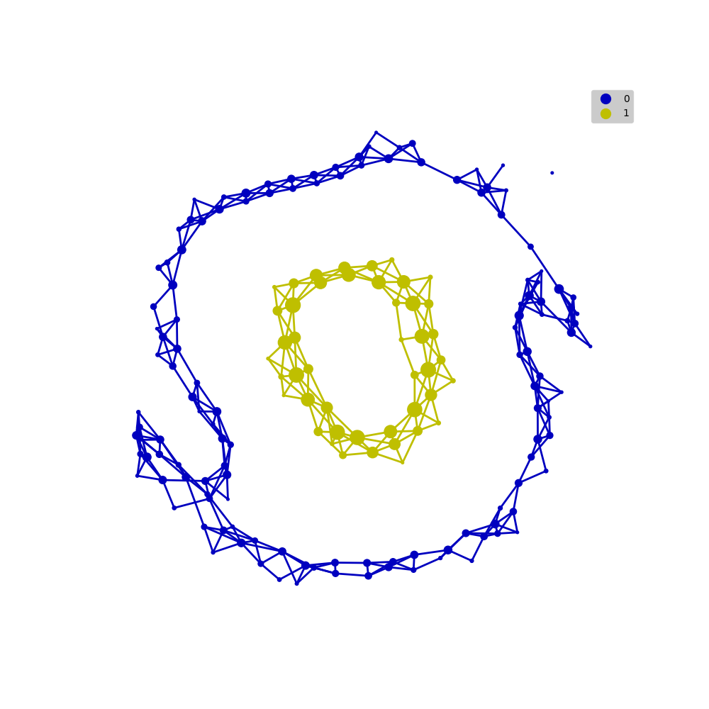
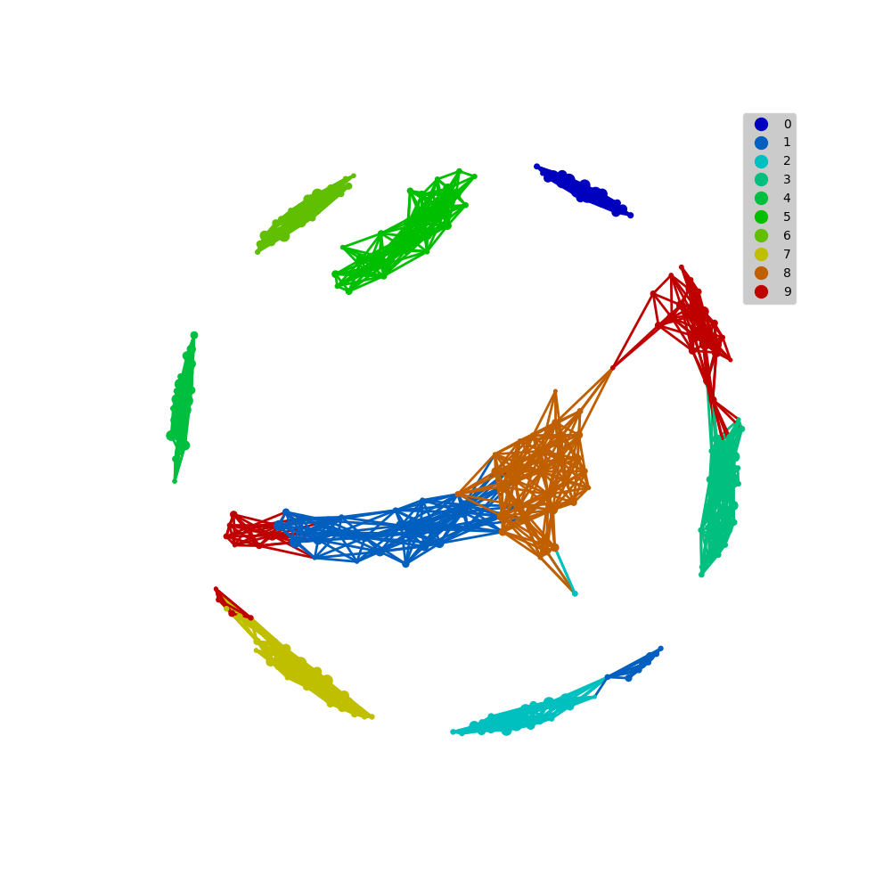

## Basic examples

Here we demonstrate a smallest example from `sklearn.datasets`.

Basic process and categorical visualization of tmap could be learned from this example.

## MNIST datasets

Using popular data sets MNIST as example to presenting the basic process of tmap.

Here is the visualization of tmap result.

## Microbial 16s data

More information could refer to [blabla paper supplementary](www.abc.com)
