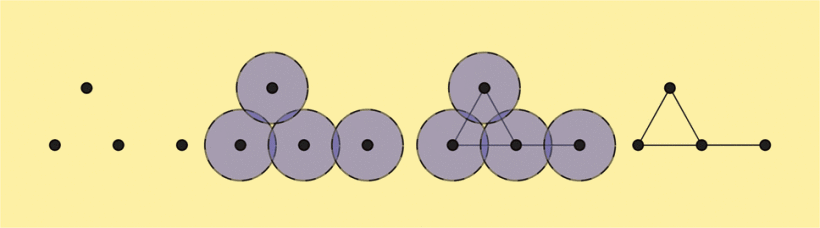
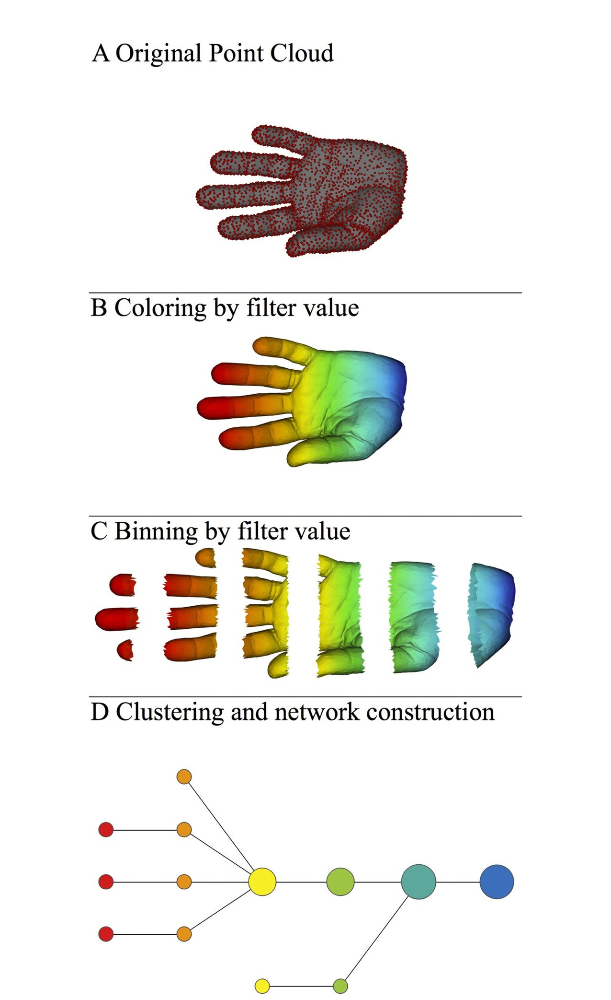

# How tmap work
Topological Data Analysis, or TDA, is the currently popular nomenclature for
the set of techniques surrounding persistence, persistent homology, and the extraction
of significant topological features from data. TDA is used to study complex high dimensional data sets by extracting shapes (patterns) and obtaining insights about them.

An especially underused TDA technique is “mapper”. I found this particularly useful for visualization, and I wonder why it isn’t as widely applied as, say, t-SNE. Mapper fits a simplicial complex to data (often, just a graph), but in a very flexible way. The goal of mapper is either data visualization or clustering.

Suppose that we start with a set of points. For a given `r > 0`, we construct the balls of radius `r` around each point of this set. We then consider an abstract collection of vertices corresponding to the given points. We **connect the vertices** pairwise by an edge if the balls intersect each other.

The nerve theorem states that, under certain conditions, the topological invariants of the union of balls of a cover coincide with those of the Čech complex. This complex is thus an enlargement of the point cloud and can be used to glean its topological properties.[Ref 1](refence/#1)

# Pipelines of mapper

Let we introduce basic pipelines in our tools.

When we get a real world data set, first we need to choose a distance metric to describe the distance between each point. In above graph, The metric is three-dimensional Euclidean distance, and the **filter** function is the x-coordinate which is already colored by the filter function values.

By using the collection of intervals with two resolution parameters (`resolution`: a number N of intervals and `overlap`:, a percent overlap), the data set is binned into groups, whose filter values lie within a single interval, giving rise to a collection of overlapping bins called hypercube.

Because we chose the intervals to be overlapping with its neighbor, the binned data represents a systematic oversampling of the original data.

The final step of this pipeline is clustering. In each cube or overlapping bins, we could cluster all points with its *origin distance* with specific clustering function. After clustering, each cluster becomes a node or a vertex in the graph. We connect two clusters with an edge if they have one or more samples in common.[Ref 2](https://www.researchgate.net/publication/235423532_Extracting_insights_from_the_shape_of_complex_data_using_topology)

## How SAFE work
Originally, spatial analysis of functional enrichment (SAFE) is a systematic method for annotating biological networks and examining their functional organization. [Ref 3](https://www.sciencedirect.com/science/article/pii/S240547121630148X?via%3Dihub)

0. Given a graph constructed by tmap.
1. For each node in the graph, SAFE defines the local neighborhood of X by identifying all other nodes located closer than a maximum distance threshold. By default, node distance is measured using the **weighted shortest path length** or using the **unweighted shortest path length**; However, other distance measures are also available.
2. By default, the maximum distance threshold d equals to the 0.5th-percentile of all pair-wise node distances in the network.
3. For each neighborhood, SAFE sums the values of neighbors for a functional attribute of interest as a neighborhood score `P`. The score is then compared to the distribution of `I` random neighborhood scores obtained by reshuffling the samples in the network and, consequently, each of the functional attribute value **independently**. The significance of the enrichment is determined as the probability that a single observation from random distribution will fall into the interval between origin neighborhood score and infinite.
4. Convert neighborhood significance p-values into neighborhood enrichment scores `O`, normalized to a range from 0 to 1, by computing:

where `I` is the permutation times, `P` is the neighborhood score between vertex *i* and vertex *j*, `O` is the neighborhood enrichment score between vertex *i* and vertex *j*. This equation is applied independently for each feature.
5. A node is considered significantly enriched for the features if:

6. Using **number of significant nodes** or **sum of SAFE score of significant nodes** to ranking features.

In `netx.SAFE`, we implement two major functions `SAFE_batch` and `SAFE` which is batch version and single version for calculating SAFE scores.
