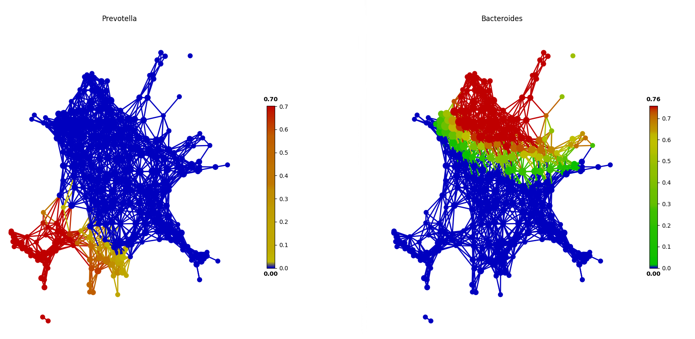

# Assoication in tmap

After visualizing SAFE score of feature, we could observe some share and similar distribution between some features. From the distribution, we could see the contribution of a feature to whole network constructed by complete data.

Base on the network and SAFE score, we could calculate the association between features and extract the above relationship. **Note that, it isn't a traditional association because it is calculated by comparing their SAFE distribution in network.**

### Highly correlated features
SAFE scores distribution between **unclassified_Clostridiaceae** and **Methanobrevibacter** in `test/test_FGFP.py`.

### uncorrelated features

SAFE scores distribution between **Prevotella** and **Bacteroides** in `test/test_FGFP.py`.

### Basic usage
