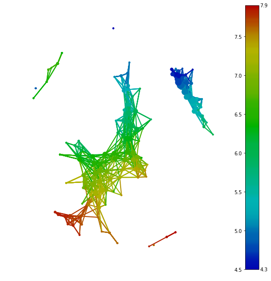
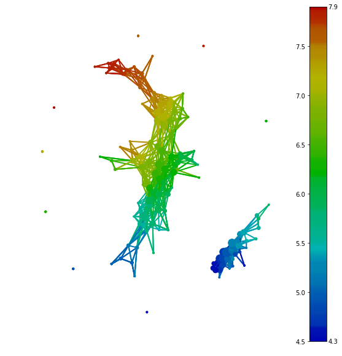
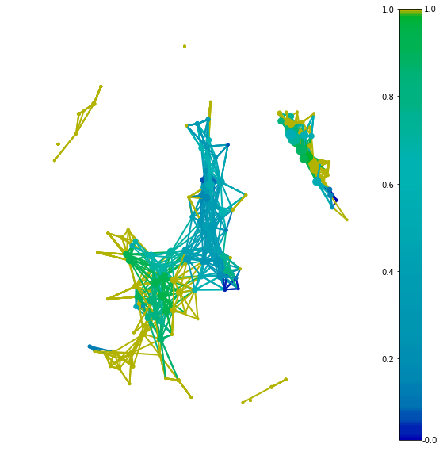

# Basic Usage of tmap
This guide can help you start working with tmap.

In our daily life, facing high dimension data and complex interaction data always is the most common things in data processing. For visualization, we need dimensionality reduction techniques or ordiantion analysis. For data processing, we need to reduce dimension to meet the requirement of algorithms or the limitation of machines.

The ***tmap*** is a method which can be used to reduce high dimensional data sets into simplicial complexes with far fewerpoints which can capture topological and geometric information at a specified resolution.

Let start the simplest case first - assuming we have data in nice tidy dataframe format.

## The Simple Case
Using the classical iris dataset as a simple example.
```python
from sklearn import datasets

iris = datasets.load_iris()
X = iris.data
```

Once we get a data and we need to initiate some basic instance such as `Mapper`, `filter`, `cluster`, `Cover`.
```python
from tmap.tda import mapper, filter
from tmap.tda.cover import Cover

# Step1. initiate a Mapper
tm = mapper.Mapper(verbose=1)

# Step2. Projection
lens = [filter.MDS(components=[0, 1])]
projected_X = tm.filter(X, lens=lens)
clusterer = DBSCAN(eps=0.75, min_samples=1)
cover = Cover(projected_data=MinMaxScaler().fit_transform(projected_X), resolution=20, overlap=0.75)
```

The data you provide to `Cover` is suggested to be transformed first.

After preparing all instance and data,all you need to do is pass data, `Cover`, `cluster` to `map` and get a returned object. A *graph* is a collection of nodes (vertices) along with identified pairs of nodes (called edges). For now, we use nest dictionary as container to stored all information of graph.

Flexible and portable classes will be implement for graph at following work.

```python
graph = tm.map(data=StandardScaler().fit_transform(X), cover=cover, clusterer=clusterer)
```
With this process, the grapp consists of 201 nodes and 1020 edges, as can be seen by:
```
print(len(graph['nodes']),len(graph['edges']))

201 1020
```
Each nodes containing several samples from origin data. Mapping relationship between nodes and samples could be found by:
```
print(graph['nodes'].items())
(0, array([ 718, 1655, 2564, 2846, 3946, 4431])),
(1, array([  69,  616,  853, 1266, 1575, 1833, 1959, 2268, 3635])),
(2, array([  28,  350,  511,  601,  616,  629,  723, 1162, 1193, 1266,
  1300,1424, 1536, 1634, 1841, 1868, 1943, 2268, 2282, 2719, 2898,
  2929,3300, 3605, 3634, 3763, 3816, 3848, 4461, 4828])),
(3, array([   1,  669,  692,  814, 1064, 1424, 1435, 1503, 1512, 1909, 2145,
  2182, 2412, 2786, 2840, 2849, 2929, 3132, 3162, 3179, 3414, 3439,
  3541, 3667, 3708, 3759, 4038, 4168, 4170, 4176, 4478, 4497, 4606,
  4938, 4974])),
......
```

## Using different distance metric
After introducing basic usage of tmap, a little more details of each classes will be discuessed. We may want to using different distance metric instead of default(Euclidean) distance metric frequently. Particularly in microbiome data analysis, most popular distance metric we used is weighted or unweighted unifrac.

For using custom distance metric, you need to set a parameter `metric` as **"precomputed"** in `filter`.

```python
lens = [filter.MDS(components=[0, 1],metric='precomputed')]
#distance = pd.read_csv('precomputed_distance.csv')
projected_X = tm.filter(dis, lens=lens)
```

The components of `filter` is also could be passed other PC for PCA or MDS. More filter will be complemented at following version.

`filter` is general method which is trying to reduce the dimension of data for decrease computation time. If there are two points are nearby in high-dimension space, `filter` with false metric or projection makes them separated far beyond each other and located in a different hyper cube. In this situation, it will make them clustering into two nodes and becoming a false positive case. If we have two distant points in origin distribution, this will not be clustering into one node because clustering is based on origin distance.

## Visualization
After constructing a graph, we should try to visualize the network into 2d graph. There are multiple tools in python to representing a graph with nodes and edges, such as `networkx`,`Graphviz`,`graph-tool`. It could design some wrappers with these tools or even using web-based forced layout html to display the graph. But currently, we just build a simplest wrapper with `networkx` and `matplolib` to visualize the graph.

Besides projecting the network, we also design a `Color` class to annotate each node with providing features.
```python
from tmap.tda.plot import show, Color
y = iris.target
color = Color(target=y, dtype="categorical")
show(data=X, graph=graph, color=color, fig_size=(10, 10), node_size=15, mode='spring', strength=0.04)
```


Depending on the type of target data, there are two type `categorical` and `numerical` we can choose. If we have a binary feature or continuous feature, we recommend `numerical` to show the distribution of data. For a binary feature, the value of a node indicating a ratio of True/False for the feature. For a multi-classes feature, you could use `categorical` to visualize most abundance category in each node. But you could also use *One-Hot encoded* method to transform a multi-classes feature into a binary feature.

## SAFE scores
After visualization, we should find a way to analyze the graph.

From original data, we just need the distance between each sample to get the graph and visualize it. The graph without color is just showing the coherent of samples. When we colorize the graph with abundance data, each feature is representing different pattern along with the graph.

SAFE score is a algorithm to reveal the pattern of features.

Plotting the first feature of iris dataset and colorize it with abundance data.
```
color = Color(target=X[:,0], dtype="numerical")
show(data=X, graph=graph, color=color, fig_size=(10, 10), node_size=15, mode='spring', strength=0.04)
```


The continuous of color showing that this feature is strongly associated with the graph. Next step is using a quantitative algorithm to represent it.


```python
from tmap.netx.SAFE import *
safe_scores = SAFE_batch(graph, meta_data=X, n_iter=1000, threshold=0.05)
color = Color(target=safe_scores[X.columns[0]], dtype="numerical")
show(data=X, graph=graph, color=color, fig_size=(10, 10), node_size=15, mode='spring', strength=0.04)
```


Please see the [*SAFE algorithm*](how2work.md) for more details.

## SAFE summary

SAFE score is not only used as a scale for color, it also should ranking features to screen or filter important features for the network which reflects inner relationship of all samples.

```python
from tmap.netx.SAFE import get_SAFE_summary

safe_summary = get_SAFE_summary(graph=graph, meta_data=X, safe_scores=safe_scores,
                                n_iter_value=1000, p_value=0.01)
```

Taking p-value 0.01 as threshold to count all significant nodes with higher SAFE score could provide some variable called ***SAFE enriched score , enriched SAFE score ratio*** to ranking the importance or significance of features.

More detailed about SAFE summary should refer to **blablabla**.

## Co-enrichment scores

Besides the association with the cohort, correlation between species and meta data also is a requisite result that we are pursuing.

In tmap, SAFE score of nodes is taking as a new measurement to reveal this kind of relationship between any features.

With SAFE score and corresponding graph, p-value and its correlation coefficient of each pair of features are calculated by pearson test and corrected by Benjamini/Hochberg correction.

```python
coenrich_edges = coenrich_v2(graph,safe_scores)

print(coenrich_edges)
```
