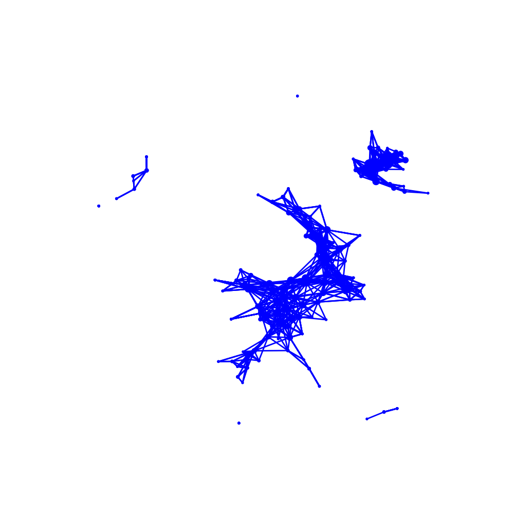
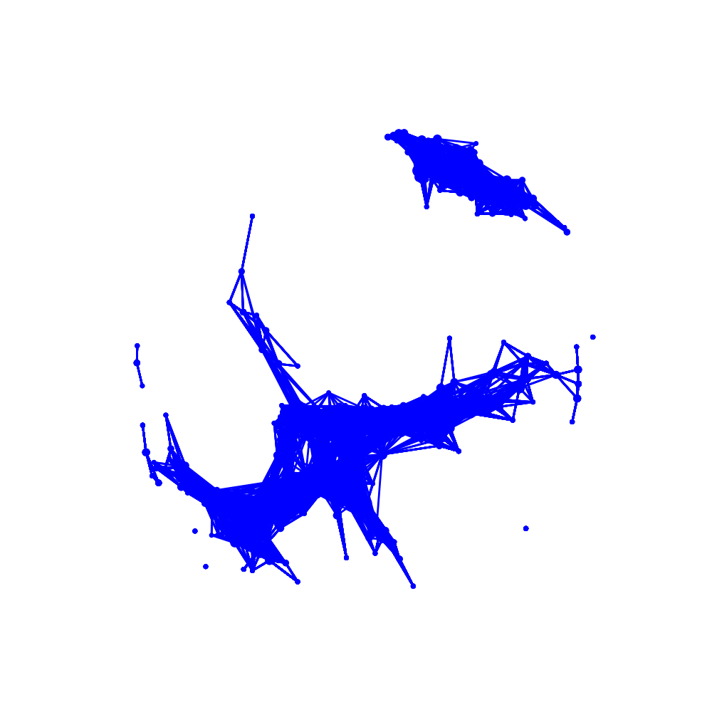
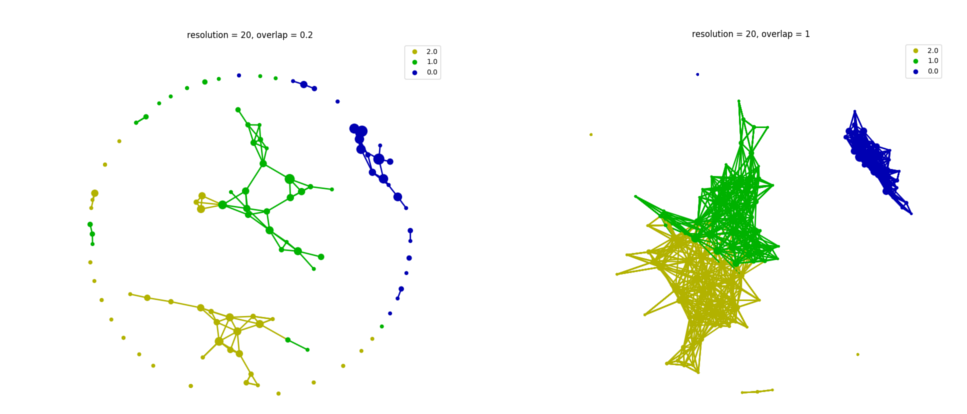
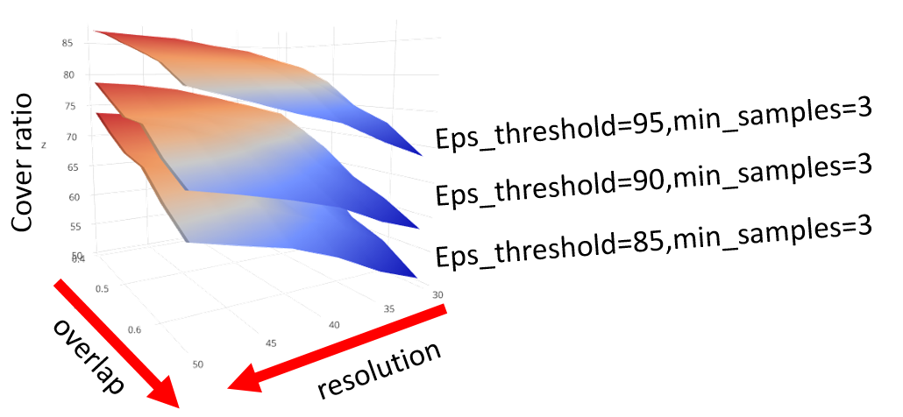

# How to choose parameters in tmap

While tmap has a simple usage way to map a high-dimension data into a 2d graph, in practice there are several parameters in tmap would influence the final graph. We will demonstrate how these parameters change would affect the final graph and how to choose them.

## Selecting `components` in `filter`
The primary parameter to effect the resulting is the `components` in `filter`. If we explore the algorithms of ***tmap*** in [how tmap work](how2work/#how-tmap-work), we could know that increasing the number components of filter will exponential increase the time of calculation and also the number of edges/nodes. Besides, changing the way of projection or chosen components is altering the angle of view to data points clouds and it will also impact the final graph we extracted from original data.

```python3
from sklearn.preprocessing import MinMaxScaler, StandardScaler
from sklearn import datasets
from sklearn.cluster import DBSCAN
from tmap.tda import mapper, filter
from tmap.tda.cover import Cover
from tmap.tda.plot import show, Color


iris = datasets.load_iris()
X = iris.data
y = iris.target

# Step1. initiate a Mapper
tm = mapper.Mapper(verbose=1)

# Step2. Projection
lens = [filter.MDS(components=[0, 1],random_state=100)]
projected_X = tm.filter(X, lens=lens)

# Step3. Covering, clustering & mapping
clusterer = DBSCAN(eps=0.75, min_samples=1)
cover = Cover(projected_data=MinMaxScaler().fit_transform(projected_X), resolution=20, overlap=0.75)
graph = tm.map(data=StandardScaler().fit_transform(X), cover=cover, clusterer=clusterer)

show(data=X,graph=graph, color='b', fig_size=(10, 10), node_size=15, mode='spring', strength=0.03)
```

```
Filtering by MDS.
...calculate distance matrix using the euclidean metric.
Finish filtering of points cloud data.
Mapping on data (150, 4) using lens (150, 2)
...minimal number of points in hypercube to do clustering: 1
...create 219 nodes.
...calculate projection coordinates of nodes.
...construct a TDA graph.
...create 1133 edges.
Finish TDA mapping
```


Using first two components of MDS as *lens*, graph with 219 nodes ans 1133 edges will be generated.

What if we choose first three components of MDS?

```python3
from sklearn.preprocessing import MinMaxScaler, StandardScaler
from sklearn import datasets
from sklearn.cluster import DBSCAN
from tmap.tda import mapper, filter
from tmap.tda.cover import Cover
from tmap.tda.plot import show

iris = datasets.load_iris()
X = iris.data
y = iris.target

# Step1. initiate a Mapper
tm = mapper.Mapper(verbose=1)

# Step2. Projection
lens = [filter.MDS(components=[0, 1,2],random_state=100)]
projected_X = tm.filter(X, lens=lens)

# Step3. Covering, clustering & mapping
clusterer = DBSCAN(eps=0.75, min_samples=1)
cover = Cover(projected_data=MinMaxScaler().fit_transform(projected_X), resolution=20, overlap=0.75)
graph = tm.map(data=StandardScaler().fit_transform(X), cover=cover, clusterer=clusterer)

show(data=X,graph=graph, color='b', fig_size=(10, 10), node_size=15, mode='spring', strength=0.17)
```

```
Filtering by MDS.
...calculate distance matrix using the euclidean metric.
Finish filtering of points cloud data.
Mapping on data (150, 4) using lens (150, 3)
...minimal number of points in hypercube to do clustering: 1
...create 921 nodes.
...calculate projection coordinates of nodes.
...construct a TDA graph.
...create 13279 edges.
Finish TDA mapping
```



We could get a graph with 921 nodes and 13279 edges. Increasing components would make the graph become bigger and redundant. If we visualize these two graphs, we could see that the general topological structure is similar. The more the number of `components` you provide, the more complicated graph will be generated because of the dimensional problems. We recommend the default parameter `components=[0,1]` in most situations.

## Selecting `resolution` and `overlap` in `Cover`

A further parameter that affects the resulting is about the `Cover` which is a sifter for any given filter. `resolution` decides how many intervals you need to extract from the original point cloud based on the `filter` in each axis. `overlap` influences how much space between each interval need to be overlapped.

For `resolution`, the number of hypercube equals to `resolution ** n_components`. Enlarging the parameter will highly increase the time of calculation but improve the precision of the graph. Theoretically, higher precision is better for retrieving more detail in the graph. But blindly enlarging `resolution` could get a catastrophe that the number of nodes is much more than the number of samples and no connections will emerge between any of nodes.


If we enlarge 10 times of the `resolution`  and leave the `overlap` unchanged will cause the situation above. High `resolution` for a small data set will cause each bin/hypercube has too few samples before clustering and no samples are located inside the overlap region. The resulting graph will become a network of discrete islands.

The smaller the `resolution` of cover, the less the graph could describe original points cloud. A suitable `resolution` could highly reduce the time and effort.

For `overlap`, it majority influences the edges between each node. The larger the `overlap` you provide, the more edges will emerge until reaching limitation. But too low `overlap` will lose some detail of origin data.



As we see above, `resolution` is an empirical param which is depended on the size of your data set. It should be carefully adjusted to depict the data set properly. The larger the `overlap` you provide, the more structure it will capture. But for visualization and calculation, we should choose a suitable value.

Apart from the general structure of the graph, these parameters also influence most **cover ratio** which is discussed below.

## Selecting `eps` and `min_samples` in DBSCAN

In tmap, default cluster called DBSCAN which requires 2 parameters - `eps`, which restrict maximum distance between two samples for them to be considered as in the same cluster; and `min_samples`, which specifies how many neighbors a point should have to be included into a cluster. However, you may not know these values in advance.

Here we implemented a function called `utils.optimize_dbscan_eps` to easily adjust `eps`.

For better performances, we should enlarge the `eps` to cover most of the pairs. To achieve this, the shortest distance from each point to its nearest neighbor will be considered together. Collecting all distance could build a distribution and using a `threshold` as a **percentile** to cut how many pairwise distance you want to cover. After passing a threshold to `optimize_dbscan_eps`, you could get a suitable `eps` for DBSCAN algorithm.

After we have chosen the value for `eps` , we may wonder how many points lie within each point's epsilon-neighborhood.

For extracting the topological properties as much as possible, we should still consider the distribution construct by the number of neighbor of each point. But not like the `eps` optimization function, we have not implemented this function yet. It may be implemented in the future.

## Optimization of *cover ratio*

*cover ratio* is a variant for measuring how many samples are retaining or missing during the transform process from data to the graph.

During the process, samples placed in a hyper cube without being clustered into any nodes will be discarded. Usually, it is taking as outlier or noise found in data.

If we don't consider *cover ratio* in tmap result, it could get a perfect result like overfitting when we drop too much samples. So *cover ratio* need to be considered

### relationship between *cover ratio* with other parameters

Given different parameters to FGFP data in example would generate under figure.


Apparently, different parameters own different relationship with *cover ratio* and it is monotonous in given range.

|paramerters|relationship|
|---|---|
|eps threshold|monotonous increasing|
|overlap|monotonous increasing|
|resolution|monotonous decreasing|
|min samples|monotonous decreasing|

## Summarize

*cover ratio* is a variant which will be impacted by every parameters and so it is hard to tell what influence it will make instead of other parameters. In general, it may cover at least 80% samples like the explained proportion of PCA.

In the case of *cover ratio* of 80%, resolution may reach `sqrt(n_samples*2)` as far as possible. Other parameters may be chosen depending on different circumstances. Note that there are not best parameters in tmap because different features may present different topological shape in high dimensional space. Using different angle of view and resulting a weird graph doesn't mean that it is a wrong graph. How to benchmark the graph properly also is open to exploration and implement in the future.
