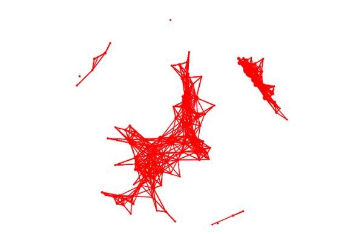
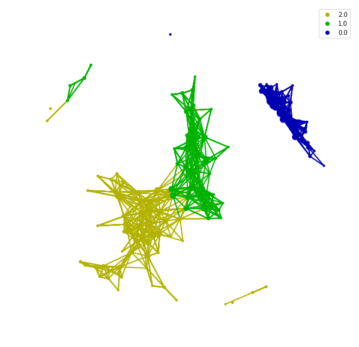

## Basic Usage and how legend work

After resulting in the graph from the mapper, visualization is the main task we should achieve. Mapper of tda is an algorithm for clustering and feature selection. And visualization is the best way to showing the clustering result and revealing the potential topological structure from a graph.

For now, all visualization in tmap are based on the `matplotlib` and `networkx`. Interactive web-based visualization would come out as soon as possible.

Back to the basic usage of the visualization, if we got a graph from below codes.
```python
from sklearn.preprocessing import MinMaxScaler, StandardScaler
from sklearn import datasets
from sklearn.cluster import DBSCAN
from tda import mapper, filter
from tda.cover import Cover
from tda.plot import show, Color


iris = datasets.load_iris()
X = iris.data
y = iris.target

# Step1. initiate a Mapper
tm = mapper.Mapper(verbose=1)

# Step2. Projection
lens = [filter.MDS(components=[0, 1],random_state=100)]
projected_X = tm.filter(X, lens=lens)

# Step3. Covering, clustering & mapping
clusterer = DBSCAN(eps=0.75, min_samples=1)
cover = Cover(projected_data=MinMaxScaler().fit_transform(projected_X), resolution=20, overlap=0.75)
graph = tm.map(data=StandardScaler().fit_transform(X), cover=cover, clusterer=clusterer)
```
After generating the graph, we could simply use `show` to visualize it without any grouping information.
```python
show(data=X, graph=graph, fig_size=(10, 10), node_size=15, mode='spring', strength=0.04)
```


Visualization without grouping information is hard to representing any thing from result. If we want to add any grouping information for this graph, we just need to pass a array/list to `color` and create a object as the param of `show`.

```python
color = Color(target=y, dtype="categorical")
show(data=X, graph=graph, color=color, fig_size=(10, 10), node_size=15, mode='spring', strength=0.04)
```



```python
color = Color(target=y, dtype="numerical")
show(data=X, graph=graph, color=color, fig_size=(10, 10), node_size=15, mode='spring', strength=0.04)
```


In `color`, we should choose which kind of data you want to display. If you provide a categorical data, you could use `dtype='categorical'` to display three colors for clustering or you could use `dtype="numerical"` to visualize the transition of each categorical.

The `target` of `color` doesn't constrained of the source but restrict by the shape. The array passing to `target` should have length equal number of samples or number of nodes.

## Visualization with importance of features.

After basic usage of visualization, we need to go further to explore what can we do at microbiome with this tool. Here is the example with 16s data from European.[Ref 4](reference). It also is the test set of tmap.

```python


```
